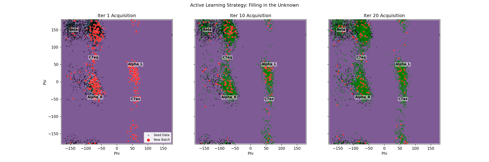
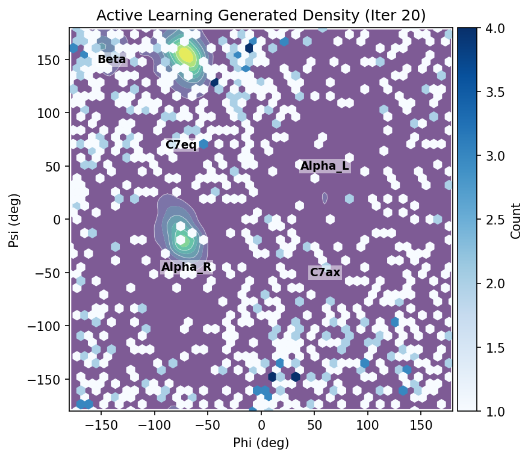

# Active Learning Loop (Backbone Generation)

[< Back: Home](index.md) | [Next: Refinement >](refinement.md)

**Primary Script**: [`scripts/run_al_loop.py`](../scripts/run_al_loop.py)

The Active Learning (AL) loop is the exploration engine. It iteratively improves a diffusion model by actively seeking out "uncertain" or novel structures.

### Step 0: Ensemble Initialization & Training
Before the loop begins, we initialize an **Ensemble** of $M$ probabilistic models (typically $M=4$).
*   **Function**: `_train_member`
*   **Process**: Each member is an EGNN-based Diffusion Model. They are trained independently on the initial seed dataset (MDShare data, 10-atom backbone).
*   **Diversity**: Diversity is induced by random initialization seeds and random dataloader shuffling. This ensures that in regions of dense data, models agree, while in unexplored regions, their predictions diverge.
*   **Training Objective**: Standard Denoising Diffusion objective: $\mathbb{E}_{t, x\_0, \epsilon} [ \lVert \epsilon - \epsilon\_\theta(x\_t, t) \rVert^2 ]$.

### Step 1: Candidate Generation (Consensus Sampling)
*   **Function**: `_sample_candidates` calls `_consensus_ddpm` or `_consensus_ddim`.
*   **Logic**: We generate a large pool of candidates (e.g., $N=1000$) to explore the landscape.
*   **Consensus Mechanism**: instead of generating from a single model, we use the **Mean** of the predicted noise from all ensemble members to guide the trajectory: $\bar{\epsilon}\_\theta(x\_t, t) = \frac{1}{M} \sum_{i=1}^M \epsilon_{\theta_i}(x\_t, t)$. This stabilizes generation.
*   **Uncertainty Estimation**: Simultaneously, we compute the **Variance** of the noise predictions: $\mathbb{V}[\epsilon] = \frac{1}{M-1} \sum (\epsilon_i - \bar{\epsilon})^2$. This variance is summed over the diffusion trajectory to produce a single scalar "Uncertainty Score" for each generated structure.

### Step 2: Acquisition (Active Selection)
*   **Function**: `select_acquisition` (from `metastategen.active_learning.acquisition`)
*   **Strategy**: Maximize Uncertainty. We select the top $k$ candidates (e.g., $k=200$) with the highest accumulated uncertainty scores.
*   **Hypothesis**: High variance implies the models disagree, meaning they have not seen data in this region. Acquiring ground truth here yields the highest Information Gain.
*   **Code Reference**: `torch.topk(scores, k=k)` identifies the indices of the most novel structures.

### Step 3: Oracle Labeling
*   **Class**: `DatasetOracle` (from `metastategen.oracles.dataset_oracle`)
*   **Role**: The Oracle acts as the "Ground Truth". In a real wet-lab setting, this would be an experiment. In our simulation, it is a lookup into a massive validation dataset (MDShare).
*   **Query**: The Oracle takes the generated candidate positions $x_{gen}$.
*   **Response**: It performs a nearest-neighbor search (using `torch.cdist`) against the 250,000-frame pool to find the physically valid structure closest to the generated candidate. This "snaps" the generated hallucination to a real physical state.
*   **Visualization**:

*Figure 2: The AL loop acquiring new points (Red) in unvisited regions (White/Empty space) compared to the initial seed (Black) and previous iterations (Green).*

### Step 4: Retraining
*   **Process**: The newly labeled Oracle structures are added to the training set (`ALDataManager`).
*   **Process**: The newly labeled Oracle structures are added to the training set (`ALDataManager`).
*   **Fine-tuning**: The ensemble members are fine-tuned for a few epochs on this augmented dataset, incorporating the new knowledge.

### Results

*Figure 3: Density of generated backbone structures after 20 iterations of Active Learning (Blues), overlaid on ground truth Ramachandran regions (Contours). The model successfully explores and covers the major metastable basins (Alpha, Beta, C7eq).*

---

[< Back: Home](index.md) | [Next: Refinement >](refinement.md)
