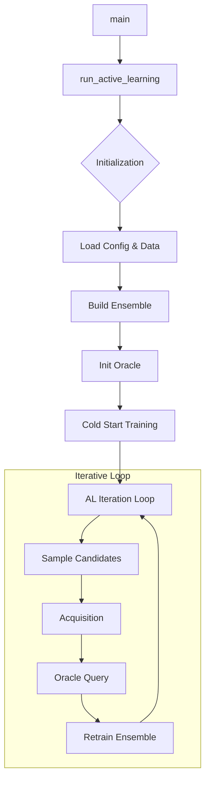

# Developer Guide: Active Learning Loop

[< Back: Data Preprocessing](data_preprocessing.md) | [Next: Refinement Loop >](refinement.md)

This guide details the internal function signatures, logic flows, and implementation details of the Active Learning (AL) Loop found in `scripts/run_al_loop.py` and `src/metastategen/workflows/active_learning.py`.

## Flow Overview

---

## 2. Core Workflow Function

### `run_active_learning`

**Location**: `src/metastategen/workflows/active_learning.py`

This function is the orchestrator. It manages the state of the active learning experiment, including data splits, model initialization, and the iterative loop.

**Inputs**:
*   `config_path` (`str`): Path to the YAML configuration file (e.g., `configs/ala2_al.yaml`).

**Key Logic**:
1.  **Config Resolution**: Loads YAML and resolves output directories (`runs/al_loop_...`).
2.  **Data Loading**:
    *   Calls `load_al_data` for both seed and validation sets.
    *   Initializes `ALDataManager` to handle the growing training dataset.
3.  **Model Building**:
    *   Iterates `cfg.ensemble.members` times.
    *   For each member, calls `build_model_from_cfg` and `build_diffusion_from_cfg` to create an `EGNN` and `GaussianDiffusion` wrapper.
    *   Wraps them in an `Ensemble` class.
4.  **Loop Execution**:
    *   **Cold Start**: Runs `_train_member` for `init_epochs` on the seed data.
    *   **Iteration**: Loops for `n_iters`. In each iteration:
        *   `_sample_candidates`: Generates unlabeled structures + uncertainty.
        *   `select_acquisition`: Picks the most uncertain candidates.
        *   `DatasetOracle.query`: Finds the nearest valid neighbor in the pool.
        *   `ALDataManager.append`: Adds new filtered data.
        *   `_train_member`: Finetunes the ensemble.

---

## 3. Sub-Functions & Logic

### `_train_member`

Trains a single ensemble member (one EGNN model).

**Inputs**:
*   `state` (`dict`): Mutable state dictionary containing `model`, `opt` (optimizer), `epoch`, etc.
*   `diffusion` (`GaussianDiffusion`): The diffusion process wrapper.
*   `dataloader` (`DataLoader`): Iterator for training data.
*   `epochs` (`int`): Number of passes over the data.
*   `grad_clip` (`float`): Max norm for gradient clipping.

**Logic**:
*   Iterates through batches.
*   **Rotation Augmentation**: If enabled, applies random $SO(3)$ rotations to input $x$.
*   **Noise Prediction**: Samples time $t \sim U[1, T]$ and noise $\epsilon \sim \mathcal{N}(0, I)$.
*   **Loss**: Computes $MSE(\epsilon - \epsilon_\theta(x_t, t))$.
*   **Optimization**: Backpropagates and steps the optimizer.

### `_sample_candidates`

Generates a pool of candidate structures to query for uncertainty.

**Inputs**:
*   `ensemble` (`Ensemble`): The committee of models.
*   `diffusion` (`GaussianDiffusion`): Shared diffusion schedule.
*   `atom_types` (`Tensor`): Condition for generation (atom types).
*   `n_samples` (`int`): Total candidates to generate (e.g., 1000).

**Logic**:
*   Batched generation loop.
*   Calls `_consensus_ddpm` (or DDIM) for the actual sampling chain.
*   Returns `samples` (positions) and `uncertainty` (variance scores).

### `_consensus_ddpm`

Performs the reverse diffusion process $p_\theta(x_{t-1}|x_t)$ using the ensemble.

**Inputs**:
*   `ensemble`: The model committee.
*   `diffusion`: The diffusion schedule.
*   `shape`: Output shape `(B, N, 3)`.

**Logic**:
1.  **Initialize**: $x_T \sim \mathcal{N}(0, I)$.
2.  **Reverse Loop**: For $t = T \dots 1$:
    *   **Ensemble Prediction**: `eps_stack = ensemble.predict_eps(x_t, t)`. Shape: `[Members, Batch, N, 3]`.
    *   **Mean**: $\bar{\epsilon} = \text{mean}(eps\_stack)$. Used for the denoising step.
    *   **Variance**: `var_eps = var(eps_stack)`. Used for uncertainty estimation.
    *   **Uncertainty Accumulation**: `unc += mean(var_eps)`.
    *   **Step**: Compute $x_{t-1}$ using standard DDPM equations with $\bar{\epsilon}$.
    *   **Constraints**: Apply `constrain_bonds` and `constrain_chirality` to keep $x_{t-1}$ physical.
3.  **Return**: Final $x_0$ and average uncertainty over the trajectory.

### `select_acquisition`

**Location**: `src/metastategen/active_learning/acquisition.py`

Selects indices to query based on the strategy.

**Inputs**:
*   `scores` (`Tensor`): The uncertainty scores from sampling.
*   `k` (`int`): Number of items to acquire.
*   `strategy` (`str`): "uncertainty" or "random".

**Logic**:
*   **Random**: `torch.randperm`.
*   **Uncertainty**: `torch.topk(scores, k=k)`. Returns indices of the highest variance samples.

---

## 4. Helper Classes

### `DatasetOracle`

**Location**: `src/metastategen/oracles/dataset_oracle.py`

Simulates an oracle using a preexisting dataset.

**Logic**:
*   **`query(candidates)`**:
    *   Uses `torch.cdist` to find distances between `candidates` and the entire `pool`.
    *   Selects `argmin` (nearest neighbor) for each candidate.
    *   Returns the ground truth positions from the pool.
