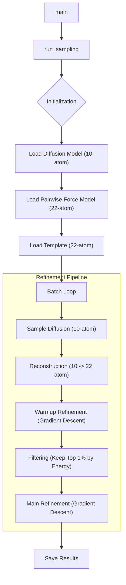

# Developer Guide: Refinement Loop

[< Back: Active Learning Loop](al_loop.md) | [Next: Analysis Pipeline >](analysis.md)

This guide details the internal function signatures and logic of the Refinement Loop (Loop B), found in `scripts/sample_refined.py` and `src/metastategen/workflows/sampling.py`.

## Flow Overview

---

## 2. Core Workflow Function

### `run_sampling`

**Location**: `src/metastategen/workflows/sampling.py`

Orchestrates the generation and physical refinement of molecular structures.

**Inputs**:
*   `diff_config`, `diff_ckpt`: Paths for the trained diffusion model (Generator).
*   `force_ckpt`: Path for the pairwise energy surrogate (Refiner).
*   `n_samples`: Total number of desired samples.
*   `refinement_steps`: Steps of gradient descent (e.g., 2000).
*   `keep_percent` (float): Fraction of samples to keep after warmup (e.g., 0.01 for top 1%).

**Key Logic**:
1.  **Model Loading**:
    *   Loads `GaussianDiffusion` + `EGNN` (trained on 10-atoms).
    *   Loads `PairwiseEnergyModel` (trained on 22-atoms).
2.  **Template Setup**:
    *   Loads a 22-atom coordinate template (`align_and_reconstruct` needs this to place hydrogens).
3.  **Batch Execution**:
    *   **A. Diffusion**: `diffusion.p_sample_loop`. Generates 10-atom backbones.
    *   **B. Reconstruction**: `align_and_reconstruct`. Maps the 10 atoms onto the 22-atom template using Kabsch alignment, effectively "placing" the missing hydrogens based on rigid body geometry.
    *   **C. Warmup Refinement**: Runs short gradient descent ($x \leftarrow x - \eta \nabla E$) to relax high-energy clashes immediately after reconstruction.
    *   **D. Filtering**: Computes energy $E(x)$ for all samples in the batch. Sorts and keeps only the lowest energy `keep_percent` (e.g., top 1%).
    *   **E. Main Refinement**: Runs long gradient descent on the survivors to push them into local minima.
    *   **Bond Constraints**: `constrain_bonds_22` is applied after every gradient step to ensure physical bond lengths.

---

## 3. Sub-Functions & Logic

### `align_and_reconstruct`

**Location**: `src/metastategen/reconstruct.py`

Maps generated backbones to full-atom structures.

**Logic**:
1.  Takes `x_gen` (10 atoms) and `template` (22 atoms).
2.  Identifies the shared 10 heavy atoms in the template.
3.  Computes the optimal rotation/translation (Kabsch) to align the template's heavy atoms to `x_gen`.
4.  Applies this transform to *all* 22 template atoms.
5.  **Result**: A 22-atom structure with backbones matching the diffusion generation and hydrogens placed via the template's local geometry.

### `constrain_bonds_22`

**Location**: `src/metastategen/workflows/sampling.py`

Enforces bond lengths during refinement. Unlike the diffusion loop (10 atoms), this operates on the relevant bonds for the full 22-atom system.

**Inputs**:
*   `x`: [Batch, 22, 3] coordinates.

**Logic**:
*   Iteratively corrects bond distances (e.g., N-CA, CA-C) to match template lengths (0.146 nm, 0.151 nm).
*   Uses a simple springs-correction: $\Delta = \text{diff} \times (\frac{target}{current} - 1.0)$.

### `load_pairwise_model`

Loads the energy surrogate.

**Returns**:
*   `model`: The neural network predicting energy.
*   `stats`: Normalization constants (`e_mean`, `e_std`). The refinement loop uses these to unscale gradients into physical force units.
