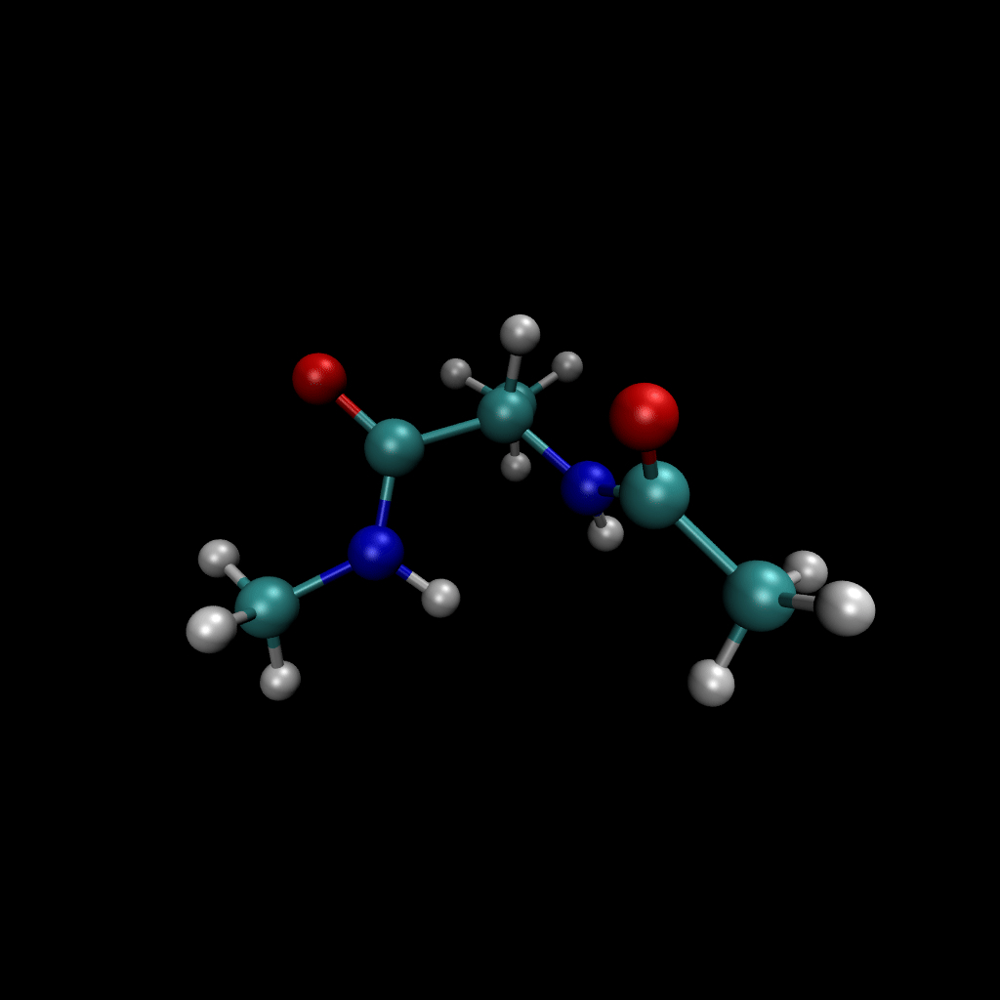

# MetaStateGen Diffusion

[Next: Active Learning >](active_learning.md)

---

Welcome to the **MetaStateGen Diffusion** project documentation.

## Project Goal
This project aims to generate physically valid, low-energy metastable states of peptides (focusing on Alanine Dipeptide) using a novel **Active Learning + Diffusion** approach.

We combine **Geometric Deep Learning (EGNN)** for capturing molecular symmetries with **Active Learning** to iteratively explore the conformational landscape.

  
   
  <em><strong>Figure 1: Generation in Action.</strong> The diffusion model generates diverse 10-atom backbones which are then reconstructed and refined into full all-atom structures.</em>

---

## 📚 Documentation Contents

### [1. Active Learning Loop](active_learning.md)
*   **Ensemble Training**: Diversity through random seeds.
*   **Acquisition**: Using uncertainty (variance) to find new states.
*   **Oracle**: Snapping hallucinated candidates to valid ground truth.

### [2. Refinement Loop](refinement.md)
*   **Reconstruction**: Converting 10-atom backbones to 22-atom all-atom structures.
*   **Geometric Correction**: Using bond constraints and warm-up.
*   **Energy Relaxation**: Using the Pairwise Force Field.

### [3. Implementation Details](implementation.md)
*   **Model Architecture**: EGNN configurations, Chirality, and Pairwise RBFs.
*   **Datasets**: MDShare vs Timewarp.

### [4. Usage Guide](usage.md)
*   **Installation**: Getting started.
*   **Running**: SLURM commands for training and sampling.

---

## Quick Overview

### The Problem
Molecular Dynamics (MD) is expensive. We want to generate diverse, low-energy molecular states without running simulation for weeks.

### The Solution
1.  **Backbone Diffusion**: A diffusion model learns to generate the heavy-atom backbone roughly.
2.  **Active Learning**: We don't just train once. We train, generate, find uncertainty, label it, and retrain. This pushes the model into new regions.
3.  **Refinement**: We use a fast surrogate model (Pairwise Force Field) to relax the rough backbones into perfect physical structures.

---

[Next: Active Learning >](active_learning.md)
