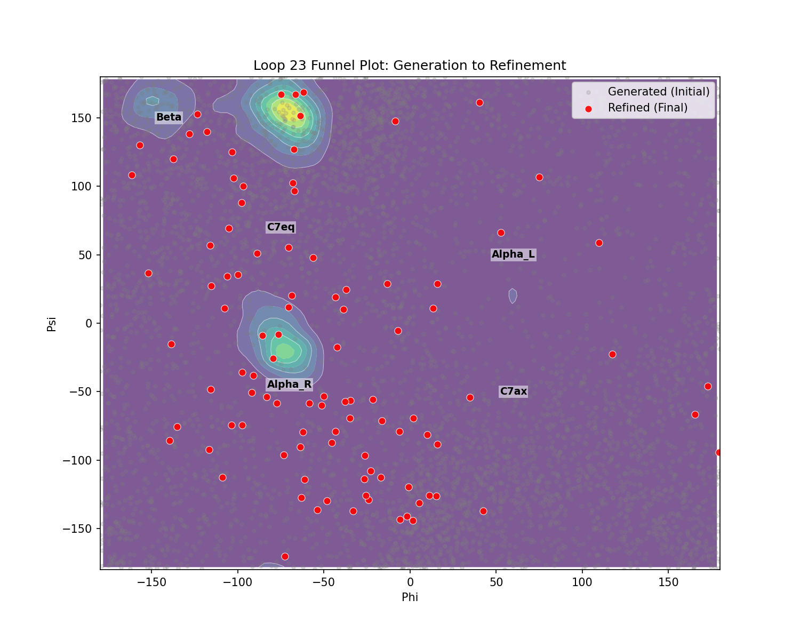

# Refinement Loop (All-Atom Reconstruction)

[< Back: Active Learning](active_learning.md) | [Next: Implementation >](implementation.md) | [Developer Guide >](developers/refinement.md)

**Primary Script**: [`scripts/sample_refined.py`](../scripts/sample_refined.py)

The Refinement Loop converts the coarse, generated backbones into physically valid, generic low-energy states using a learned Pairwise Force Field.

### Step 1: Template Alignment & Reconstruction
*   **Function**: `align_and_reconstruct` (from `metastategen.reconstruct`)
*   **Input**: 10-atom backbone from Diffusion ($X_{gen}$).
*   **Algorithm**: Kabsch Algorithm.
    1.  We take a reference Ideal Alanine Dipeptide template (22 atoms).
    2.  We extract its 10 backbone atoms.
    3.  We compute the optimal Rotation $R$ and Translation $T$ to align the template backbone to $X_{gen}$.
    4.  We apply $(R, T)$ to the **full** 22-atom template.
    5.  **Critical Step**: We overwrite the backbone positions with $X_{gen}$ to preserve the diffusion model's generated conformation, while keeping side-chains attached rigidly.

### Step 2: Warm-up Phase (Geometric Correction)
*   **Goal**: The rigid reconstruction creates "Frankenstein" molecules where side-chains might clash sterically or bonds might be slightly stretched.
*   **Process**: 1000 steps of gradient descent using the **Pairwise Force Model**.
*   **Bond Constraints**:
    *   **Function**: `constrain_bonds_22`
    *   **Logic**: The force model is soft. To prevent atoms from drifting into vacuum or collapsing, we explicitly project the N-CA and CA-C bonds to fixed physical lengths (1.46Å, 1.51Å) after every gradient step. This is a "Shake"-like algorithm implemented via iterative coordinate correction.

### Step 3: Energy Filtering
*   **Model**: `PairwiseEnergyModel`
*   **Logic**: We predict the potential energy $E(x)$ of all warmed-up candidates.
*   **Selection**: We keep only the top $1\%$ of structures (lowest Energy). This filters out kinetically trapped states or geometric disasters that the warm-up could not fix.

### Step 4: Main Refinement (Relaxation)
*   **Process**: The surviving candidates undergo a deep relaxation (50,000 steps).
*   **Physics**: This mimics an energy minimization or low-temperature molecular dynamics simulation. The structure slides down the Potential Energy Surface (PES) predicted by the surrogate model into the nearest local metastable basin.

### Results

*Figure 4: Refinement Funnel Plot. Initial coarse structures (Blue) generated by diffusion have high energy and scattered geometry. After refinement (Red), they collapse into low-energy, physically valid metastable states matching the ground truth (Contours).*

---

[< Back: Active Learning](active_learning.md) | [Next: Implementation >](implementation.md) | [Developer Guide >](developers/refinement.md)
